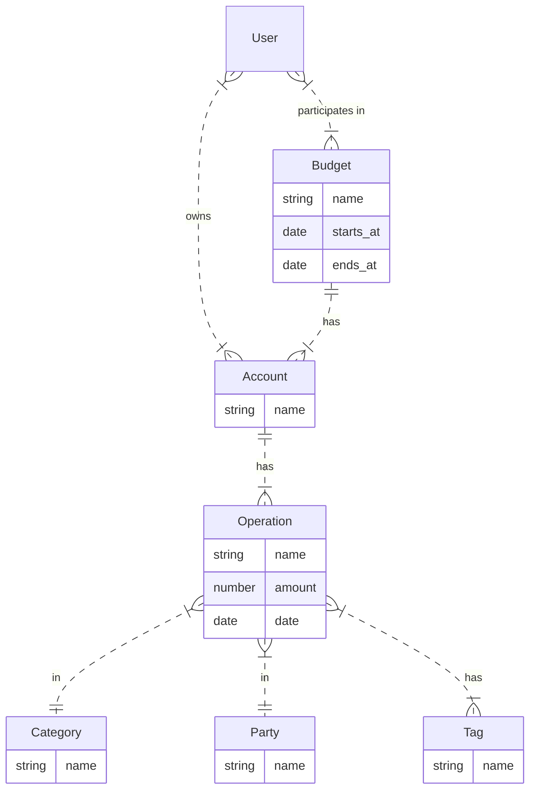

# Bajeti API

## Data model

```mermaid
erDiagram
    User }|..|{ Account : owns
    User }|..|{ Budget : "participates in"
    Budget ||..|{ Account : has
    Account ||..|{ Operation : has
    Operation }|..|| Category: in
    Operation }|..|| Party: in
    Operation }|..|{ Tag: has
    Account {
        string name
    }
    Budget {
        string name
        date starts_at
        date ends_at
    }
    Category {
        string name
    }
    Operation {
        string name
        number amount
        date date
    }
    Party {
        string name
    }
    Tag {
        string name
    }

```